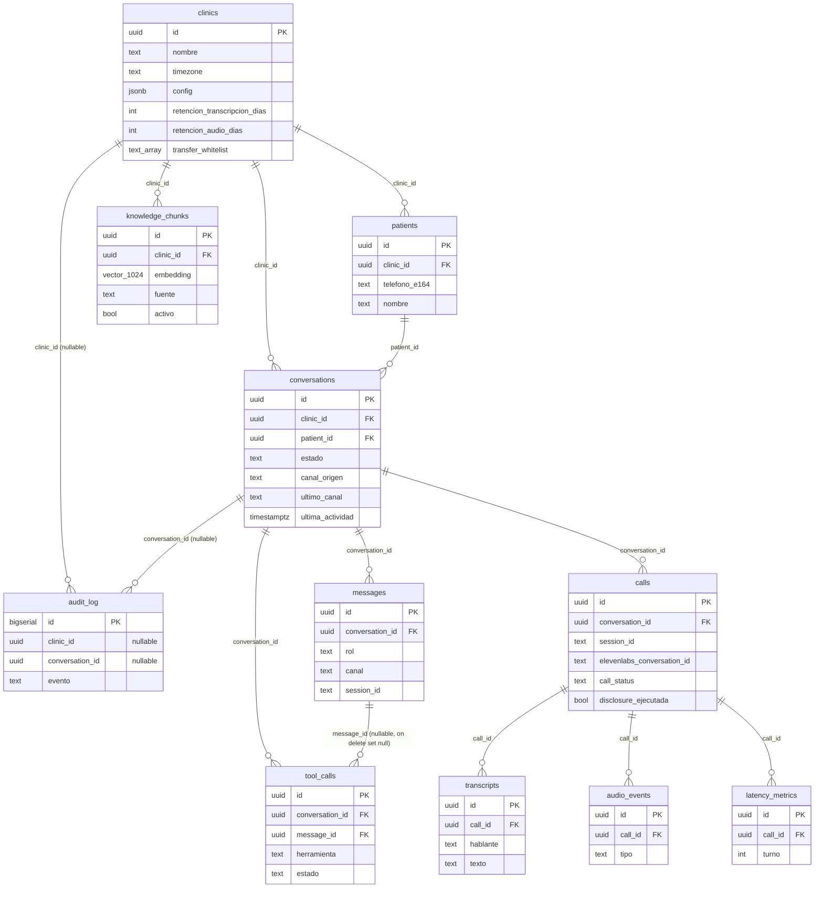

# Esquema de base de datos — Recepcion-IA

Este documento acompana las migraciones `db/migrations/001_init.sql`,
`002_rls.sql` y `003_functions.sql`. No repite el detalle columna por columna
(esta en el SQL, comentado); explica las relaciones y, sobre todo, por que
`conversations.id` es la pieza que sostiene la continuidad multicanal.

## Diagrama de relaciones

Notas de lectura del diagrama:

- Las flechas de `clinics` marcan el limite de aislamiento por inquilino
  (control C9 del informe etico; `002_rls.sql` lo aplica en cada tabla que
  cuelga, directa o transitivamente, de `clinic_id`).
- `audit_log` cuelga de `clinics` y de `conversations` con FK **nullable**
  (hay eventos de plataforma sin clinica ni conversacion asociadas, p. ej. un
  fallo de arranque) y sin relacion de borrado en cascada real desde el punto
  de vista del negocio: es el unico registro que no se puede alterar despues
  de escrito (control C10; ver el `revoke` al final de `001_init.sql`).
- `tool_calls.message_id` es la unica FK con `on delete set null`: una
  herramienta se puede haber ejecutado a partir de un mensaje que despues se
  borra (poco probable, dado que `messages` no tiene proceso de borrado hoy,
  pero la especificacion lo declaro asi y se respeta).

## Por que `conversations.id` es la clave de la continuidad multicanal

La restriccion arquitectonica no negociable del proyecto (seccion 0 de la
especificacion) es que **el canal es un atributo del mensaje, no una
propiedad del sistema**. La tabla `conversations` es donde esa frase se
convierte en esquema:

1. **Una conversacion no pertenece a un canal.** `conversations` no tiene
   columna `canal`: tiene `canal_origen` (con que canal empezo) y
   `ultimo_canal` (con cual continua ahora). El canal vive en `messages.canal`
   -cada mensaje individual lo declara- porque la especificacion es literal
   en esto: "EL CANAL ES ATRIBUTO DEL MENSAJE". Si `conversations` tuviera una
   columna `canal` unica, seria imposible representar "empezo por voz y sigue
   por WhatsApp" sin inventar una fila nueva, que es exactamente lo que el
   diseno evita.

2. **`conversation_id` es el ancla que sobrevive al salto de canal.** El
   criterio de aceptacion de la seccion 10 lo dice sin ambiguedad: *"iniciar
   por voz -> colgar -> escribir por WhatsApp -> el agente retoma con el
   contexto y el MISMO conversation_id"*. Todo lo demas -`messages`, `calls`,
   `tool_calls`, y transitivamente `transcripts`/`audio_events`/
   `latency_metrics`- se referencia por `conversation_id` (directo o via
   `call_id`), asi que el historial completo de un paciente, sin importar por
   donde escribio o llamo, se recupera con una sola clave. Si en vez de eso el
   sistema tuviera una tabla `whatsapp_conversations` y otra
   `voice_conversations`, el `MessageRouter` tendria que fusionar dos
   historiales cada vez que el paciente cambia de canal -y la fusion es
   exactamente la clase de logica de negocio que la especificacion prohibe
   duplicar por canal (seccion 0: *"si aparece logica de negocio duplicada
   por canal, el diseno esta mal implementado"*).

3. **Como se decide "misma conversacion o una nueva".** `message.router.ts`
   (fuera del alcance de esta rama, pero el contrato lo fija en
   `ConversationRepository.findActiveWithin` de `src/core/types/ports.ts`)
   busca una conversacion de ese `(clinic_id, patient_id)` cuya
   `ultima_actividad` este dentro de la ventana de continuidad
   (`VENTANA_CONTINUIDAD_HORAS`, 72h por defecto). El indice
   `(clinic_id, patient_id, ultima_actividad desc)` de `conversations`
   (definido literalmente en la especificacion, seccion 3) es justo el que
   hace esa busqueda barata: sin el, cada mensaje entrante -de cualquiera de
   los dos canales- forzaria un recorrido completo de la tabla para decidir
   si continua una conversacion o abre una nueva.

4. **`patient_id`, no el numero de telefono, es la identidad real dentro del
   dominio.** El telefono E.164 identifica al paciente (`patients.telefono_e164`,
   unique junto a `clinic_id`), pero la conversacion se ancla a `patient_id`
   -un uuid estable- precisamente porque el telefono es un dato de contacto
   que en teoria podria cambiar o reasignarse; la identidad de negocio del
   paciente no deberia depender de que ese numero siga siendo el mismo para
   siempre. `conversation_id` hereda esa estabilidad: es estable respecto al
   canal (no cambia si el paciente salta de voz a texto) y esta anclado a una
   identidad de paciente que tampoco depende del canal.

En una frase: `conversations.id` es la unica clave que un mensaje de
WhatsApp y un turno de una llamada telefonica pueden compartir sin que
ninguna de las dos tablas de canal (`calls`, ni siquiera `messages` via su
columna `canal`) tenga que saber que existe la otra.
